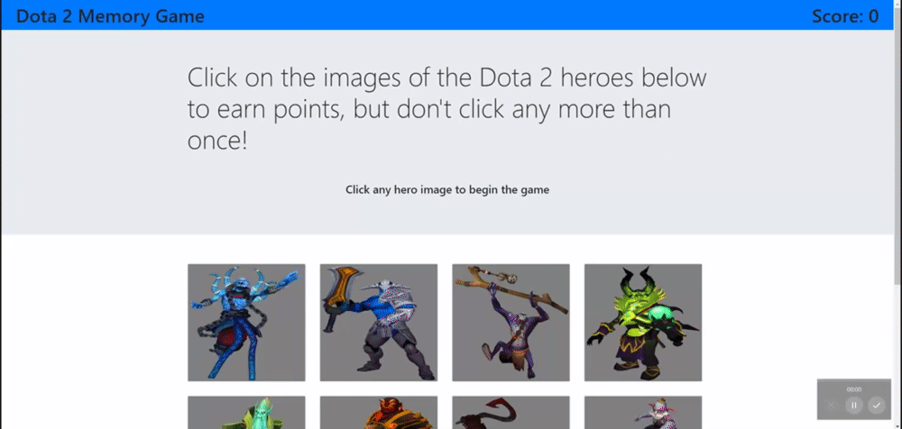
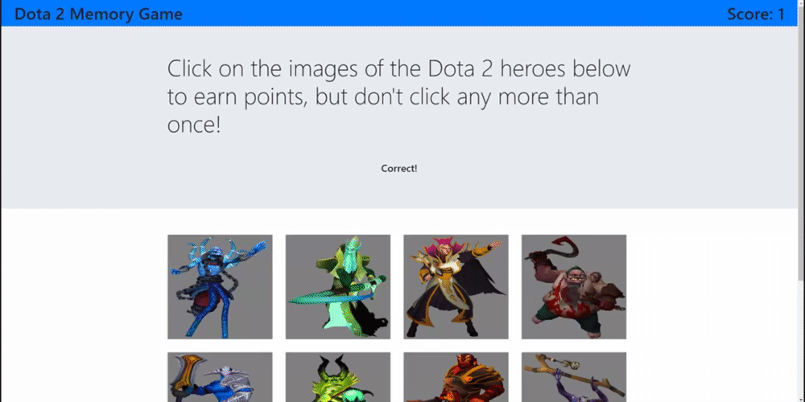

# React Memory Game

## Deployed Link

To use the app, navigate to the deployed link on Github Pages found [here](https://sbarrow825.github.io/Clicky-Game/)

## Description

A memory game app using React that challenges you to select all images without selecting a single one more than once.

## Table of Contents

* [Usage](#Usage)
* [License](#License)
* [Dependencies](#Dependencies)
* [Contributions](#Contributions)
* [Questions](#Questions)

## Usage

1) To start the game, simply click on any of the images that appear on the screen.

 

2) Don't click the same image twice, or your score will be reset to 0

 

Try to selecting all 12 images before selecting any one of them twice.

## License

## Dependencies

List of dependency statuses for all packages used in this project

* React 
* gh-pages 

## Questions

For any questions concerning this project, please feel free to email me at sbarrow825@berkeley.edu

